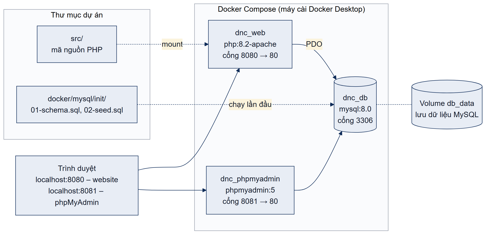

# Hướng dẫn cài đặt – Website Trường Trung học Quốc tế DNC

## 1. Thành phần

| Tệp | Mục đích |
|---|---|
| `install-docker.bat`, `install-docker.sh` | Cài đặt và chạy website bằng Docker (khuyến nghị) |
| `install-xampp.bat` | Tạo cơ sở dữ liệu `dnc_school` và dữ liệu mẫu trên XAMPP |
| `so-do-trien-khai.png` | Sơ đồ triển khai |
| `test-data/` | Tệp dùng cho các ca kiểm thử đã báo cáo |

Mã nguồn nằm ở `src/`, cấu hình Docker và tệp SQL khởi tạo nằm ở `docker/` (`docker/mysql/init/01-schema.sql`, `02-seed.sql`).

## 2. Sơ đồ triển khai



| Container | Image | Cổng | Vai trò |
|---|---|---|---|
| `dnc_web` | php:8.2-apache | 8080 → 80 | Website, DocumentRoot là `src/public` |
| `dnc_db` | mysql:8.0 | 3306 | Cơ sở dữ liệu `dnc_school`, dữ liệu lưu trong volume `db_data` |
| `dnc_phpmyadmin` | phpmyadmin:5 | 8081 → 80 | Quản lý cơ sở dữ liệu qua trình duyệt |

## 3. Cách 1 – Docker (khuyến nghị)

Yêu cầu: Docker Desktop (Windows, macOS) hoặc Docker Engine có Compose v2 (Linux); các cổng 8080, 8081, 3306 còn trống.

1. Chạy script cài đặt từ thư mục gốc của repository:
   - Windows: `setup\install-docker.bat`
   - Linux, macOS: `sh setup/install-docker.sh`
2. Mở http://localhost:8080.

Script tạo `docker/.env` từ `docker/.env.example` (nếu chưa có) rồi chạy `docker compose up -d --build`. Ở lần chạy đầu, MySQL tự thực thi `01-schema.sql` và `02-seed.sql`.

Các lệnh thường dùng (chạy trong thư mục `docker`):

| Lệnh | Tác dụng |
|---|---|
| `docker compose logs -f web` | Xem log website |
| `docker compose down` | Dừng, giữ nguyên dữ liệu |
| `docker compose down -v` rồi `docker compose up -d` | Xóa dữ liệu và khởi tạo lại dữ liệu mẫu |

Nếu cổng bị trùng, sửa `WEB_PORT`, `PMA_PORT`, `DB_PORT` trong `docker/.env`.

## 4. Cách 2 – XAMPP

Yêu cầu: XAMPP có PHP 8.2 trở lên.

1. Chép repository vào máy, ví dụ `C:\xampp\htdocs\dnc`.
2. Thêm vào cuối `C:\xampp\apache\conf\extra\httpd-vhosts.conf` (sửa đường dẫn nếu khác):

   ```apache
   Listen 8080
   <VirtualHost *:8080>
       DocumentRoot "C:/xampp/htdocs/dnc/src/public"
       <Directory "C:/xampp/htdocs/dnc/src/public">
           AllowOverride All
           Require all granted
       </Directory>
   </VirtualHost>
   ```

3. Khởi động Apache và MySQL trong XAMPP Control Panel.
4. Chạy `setup\install-xampp.bat` để tạo cơ sở dữ liệu (hoặc import lần lượt `docker/mysql/init/01-schema.sql` và `02-seed.sql` bằng phpMyAdmin).
5. Mở http://localhost:8080.

Ứng dụng đọc cấu hình từ biến môi trường; khi không có, giá trị mặc định là `localhost`, người dùng `root`, mật khẩu rỗng, CSDL `dnc_school` và địa chỉ `http://localhost:8080`, khớp với cấu hình XAMPP mặc định.

## 5. Tài khoản và dữ liệu mẫu

| Dữ liệu | Nội dung |
|---|---|
| Tài khoản quản trị | `admin@dnc.edu.vn` / `Admin@123` (vai trò admin) – đổi mật khẩu khi triển khai thật |
| Chương trình đào tạo | IGCSE; A-Level / IB Diploma; Chương trình Giáo dục Việt Nam |
| Tin tức | 2 bài công khai, 1 bài nháp (`/tin-tuc/bai-viet-nhap`) |
| Hình ảnh | 4 ảnh thuộc 2 album: cơ sở vật chất, hoạt động |
| Hồ sơ đăng ký | 2 hồ sơ mẫu ở trạng thái Mới và Đã liên hệ |

Thông tin trường (địa chỉ, điện thoại, email) là dữ liệu mẫu, cập nhật tại `/admin/cai-dat`.

## 6. Dữ liệu thử tương ứng kết quả trong báo cáo

Các ca dưới đây khớp với Bảng 4.1–4.3 của báo cáo (chạy ngày 26/09/2026, 16/16 ca đạt). Tệp đính kèm lấy trong `test-data/`.

| Mã | Thao tác | Dữ liệu thử | Kết quả mong đợi |
|---|---|---|---|
| TC01 | Mở `/` | – | Trang chủ hiển thị đủ các khối, không lỗi PHP |
| TC02 | Mở `/tin-tuc/khai-giang-nam-hoc-moi-2026-2027`, sau đó `/tin-tuc/bai-viet-nhap` | – | Bài công khai hiển thị; bài nháp trả về 404 |
| TC03 | Gửi form `/dang-ky-nhap-hoc` | Họ tên, email, điện thoại, khối 10, chương trình IGCSE, học bạ `hoc-ba-hop-le.pdf` | Chuyển đến trang thành công; hồ sơ mới có trạng thái `moi` |
| TC04 | Gửi form đăng ký thiếu email, sau đó nhập email `abc` | Các trường khác như TC03 | Báo lỗi tại ô Email, giữ dữ liệu đã nhập, không tạo hồ sơ |
| TC05 | Đăng nhập `/admin/login` | `admin@dnc.edu.vn` / mật khẩu sai | Từ chối với thông báo chung “Email hoặc mật khẩu không đúng.” |
| TC06 | Thêm tin tại `/admin/tin-tuc/them` | Tiêu đề bất kỳ, trạng thái Công khai, ảnh `anh-hop-le.png` | Tin xuất hiện ở trang quản trị và `/tin-tuc` |
| SEC04 | Tải `shell.php`, `shell.php.png`, `shell.pdf` vào form đăng ký hoặc form tin tức | Tệp chứa mã PHP | Bị từ chối: “Định dạng tệp không được hỗ trợ.” |
| E4 | Tạo tài khoản vai trò Biên tập tại `/admin/tai-khoan/them`, đăng nhập bằng tài khoản đó rồi mở `/admin/cai-dat` | – | Trả về 403, tab Cài đặt và Tài khoản bị ẩn |
